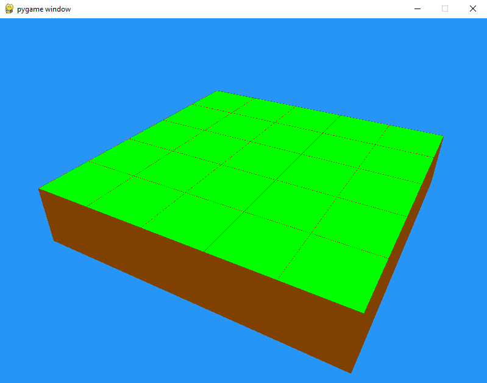
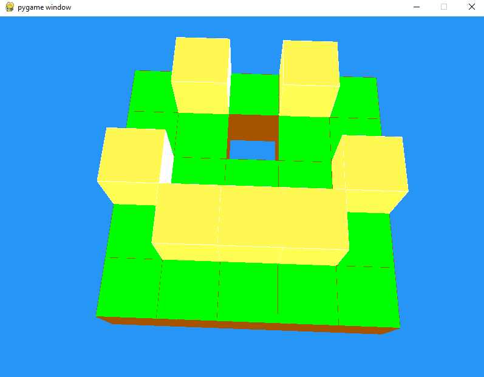

# miniCraft 

This is a small minecraft clone to learn the basics of openGL 

* Player movement 
* Mouse Orientation
* Flat world generation 
* Interacting with cubes

Controls:
```
W:              Front
S:              Back 
D:              Right 
A:              Left 
Space:          Up 
X:              Down
Right-Click:    Remove block 
Left-Clickl:    Add Block
```

## Screenshots



